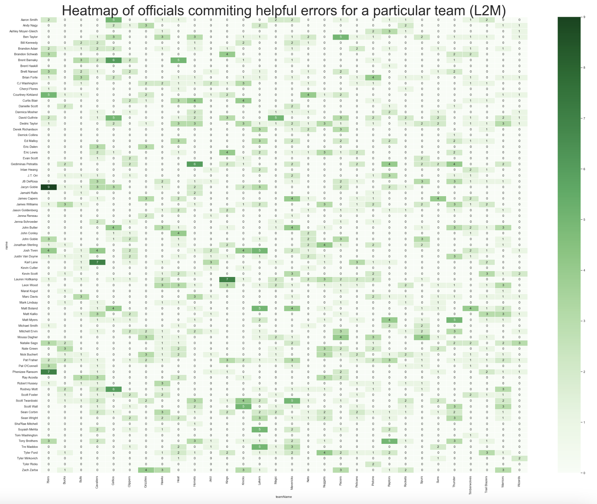
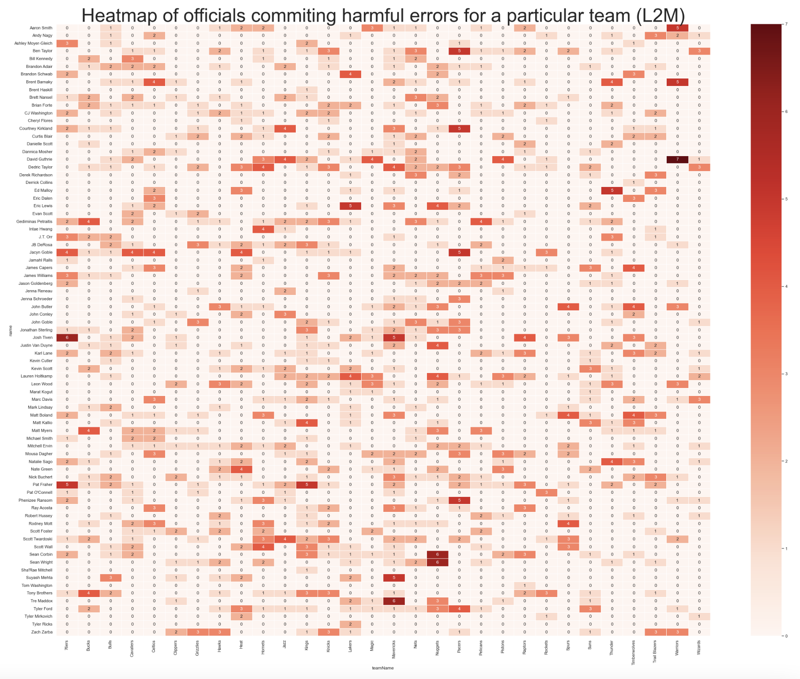
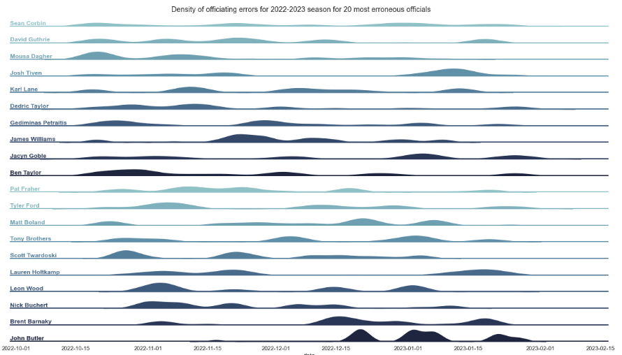
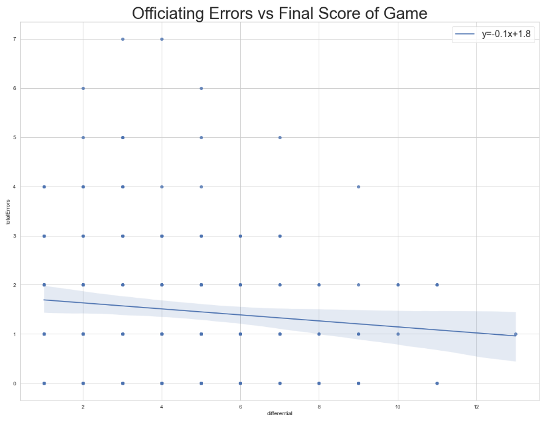

# l2m

### What is this?
A few notebooks scraping NBA data related to refereeing and L2M reports. It also includes the retrieved data as of Feb 1, 2023.

### Where is the data from?
1. NBA L2M reports retrieved from the official NBA website.
2. Officiating information retreived from the official NBA website. 
> I do not own any of this data - I simply scraped it from the NBA website. 

### Ideas (Submit a Git Issue if you have an idea of your own):
1. Which team has benefitted the most from erroneous mistakes?
2. Which team has the greatest delta in errors in favor vs harmful errors?
3. Consider the impact specific referees have in officiating errors?
4. Tie in betting lines to see how errors influence covers for bets?

### Example Insights (All insights relative to the last 2 minutes of an NBA game, as per L2M report):

#### Which NBA team has had more unfavorable errors vs favorable errors? Which NBA team has had more favorable errors?
> Data accurate prior to games played on January 31, 2023.

#### Average officiating errors in the last 2 minutes of a game (as accured by the 3 person crew the official belongs to):
> Data accurate prior to games played on January 31, 2023.
> Slightly misleading, as an error is assigned to an official if someone in their crew made the mistake. For example, it is theoretically possible Jacyn Goble has never comitted an officating mistake in the last 2 minutes of a game, but is unfortunately a part of consistently erroneous crews.

#### Which officials have been members of crews that most frequently "assisted" particular NBA teams with erroneous foul calls?
> Data accurate prior to games played on January 31, 2023.
> Slightly misleading, as an error is assigned to an official if someone in their crew made the mistake. For example, it is theoretically possible Jacyn Goble has never comitted an officating mistake in the last 2 minutes of a game, but is unfortunately a part of consistently erroneous crews.

#### Which officials have been members of crews that most frequently "harmed" particular NBA teams with erroneous foul calls?
> Data accurate prior to games played on January 31, 2023.
> Slightly misleading, as an error is assigned to an official if someone in their crew made the mistake. For example, it is theoretically possible Jacyn Goble has never comitted an officating mistake in the last 2 minutes of a game, but is unfortunately a part of consistently erroneous crews.

#### At an individual official level, what is the delta between helpful and harmful erroneous foul calls?
> Data accurate prior to games played on January 31, 2023.
> Slightly misleading, as an error is assigned to an official if someone in their crew made the mistake. For example, it is theoretically possible Jacyn Goble has never comitted an officating mistake in the last 2 minutes of a game, but is unfortunately a part of consistently erroneous crews.

#### Density of officiating errors for 2022-2023 season for 20 most erroneous officials
> Data accurate prior to games played on January 31, 2023.
> Slightly misleading, as an error is assigned to an official if someone in their crew made the mistake. For example, it is theoretically possible Jacyn Goble has never comitted an officating mistake in the last 2 minutes of a game, but is unfortunately a part of consistently erroneous crews.

#### Officiating Errors vs Final Score of Game
> Data accurate prior to games played on January 31, 2023.
> Slightly misleading, as an error is assigned to an official if someone in their crew made the mistake. For example, it is theoretically possible Jacyn Goble has never comitted an officating mistake in the last 2 minutes of a game, but is unfortunately a part of consistently erroneous crews.

